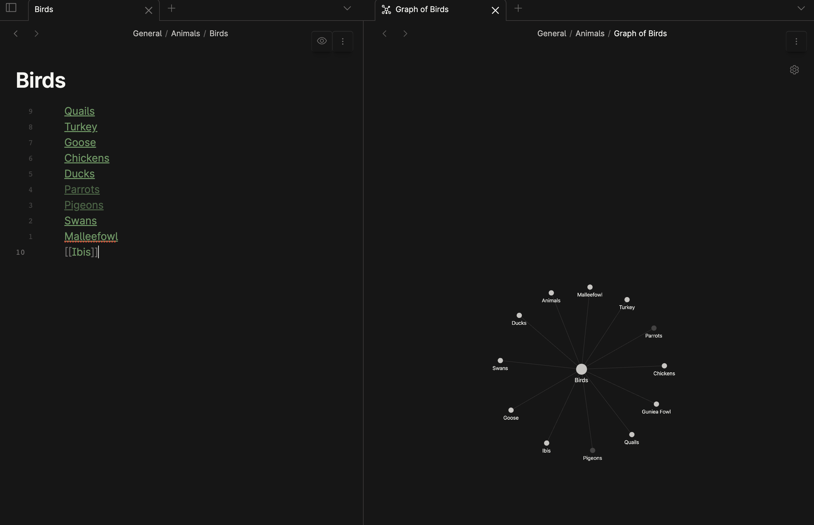

# Copy Local Paths

A simple Obsidian plugin that copies file paths from links in the current note, formatted for external use. Ideal for generating file path lists for documentation, scripts, or integrations.

## Features

- **Base Path Support**: Prepend a custom base path (e.g., a GitHub repo URL).
- **Exclusion Filters**: Ignore specific folders using comma-separated names.
- **Flexible Output**: Copy paths as newline-separated or semicolon-separated values.

## Example Usage

### Example Output Formats

#### Semicolon-Separated
```
myVault/Unorganised/Quails.md;myVault/General/Animals/Turkey.md;myVault/General/Animals/Goose.md;myVault/Chickens.md;myVault/General/Animals/Ducks.md;myVault/Unorganised/Swans.md;myVault/General/Animals/Malleefowl.md;myVault/Unorganised/Ibis.md
```

#### Newline-Separated
```
myVault/Unorganised/Quails.md
myVault/General/Animals/Turkey.md
myVault/General/Animals/Goose.md
myVault/Chickens.md
myVault/General/Animals/Ducks.md
myVault/Unorganised/Swans.md
myVault/General/Animals/Malleefowl.md
myVault/Unorganised/Ibis.md
```



## Using Paths in RAG (Retrieval-Augmented Generation)

You can integrate these file paths into a RAG-based AI workflow using `aichat`. Here’s an example:

```
(base) user@machine:~/ > aichat --rag birds 
> Select embedding model: openai:text-embedding-3-large (max-tokens:8191;max-batch:100;price:0.13)
> Set chunk size: 3000
> Set chunk overlay: 150
> Add documents: myVault/Unorganised/Quails.md;myVault/General/Animals/Turkey.md;myVault/General/Animals/Goose.md;myVault/Chickens.md;myVault/General/Animals/Ducks.md;myVault/Unorganised/Swans.md;myVault/General/Animals/Malleefowl.md;myVault/Unorganised/Ibis.md
Load myVault/Unorganised/Quails.md [1/8]
Load myVault/General/Animals/Turkey.md [2/8]
Load myVault/General/Animals/Goose.md [3/8]
Load myVault/Chickens.md [4/8]
Load myVault/General/Animals/Ducks.md [5/8]
Load myVault/Unorganised/Swans.md [6/8]
Load myVault/General/Animals/Malleefowl.md [7/8]
Load myVault/Unorganised/Ibis.md [8/8]
✨ Saved rag to '/Users/user/Library/Application Support/aichat/rags/birds.yaml'.
Welcome to aichat 0.23.0
Type ".help" for additional help.
@birds> tell me about the different birds
```

This setup allows the AI to retrieve and summarize information about the specified birds efficiently.

